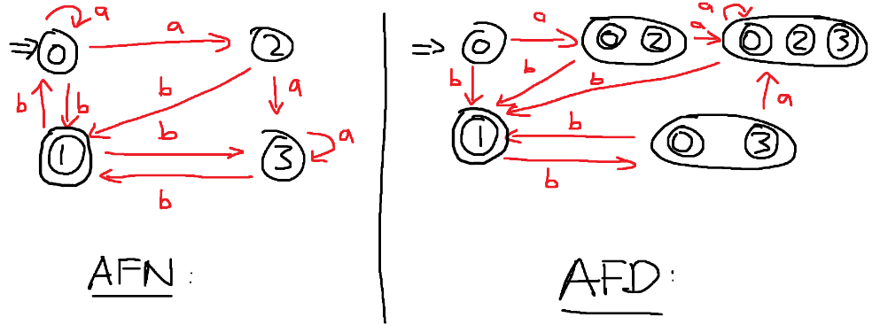
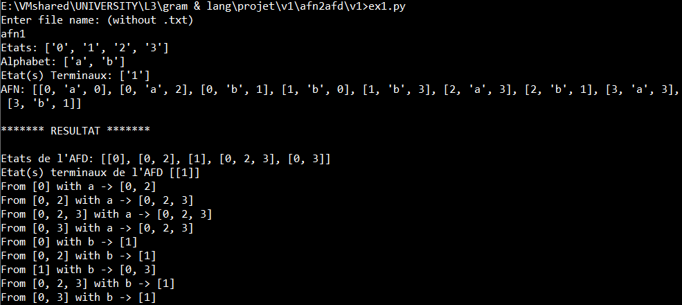
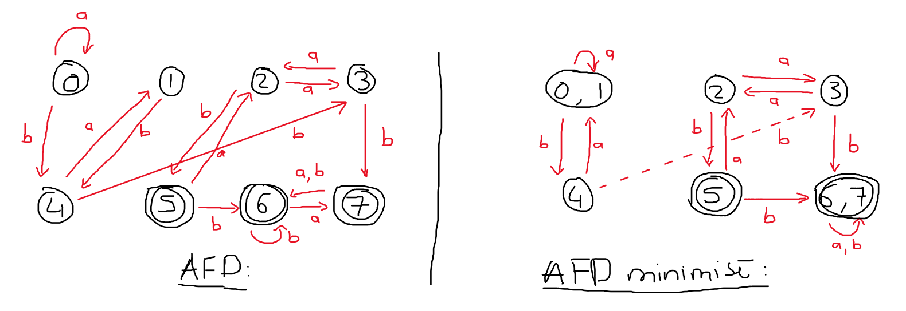
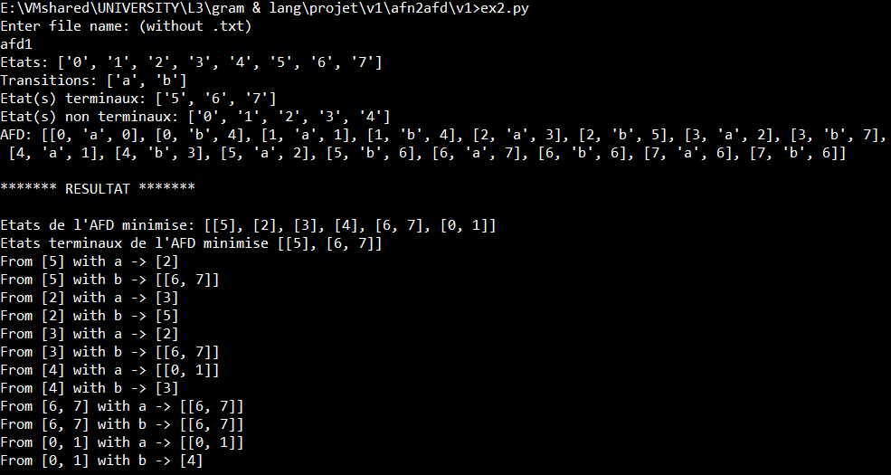

<h1 align="center"> NFA to DFA converter + DFA minimisation </h1>
 

<h2 align="center"> NFA to DFA converter </h2>

  

  

  

This program takes a text file as input representing an NFA and displays the corresponding DFA in the console.  
 

<h2 align="center"> DFA minimisation </h2>
 

  

  

This program takes a text file as input representing an DFA and displays the minimised DFA in the console.  

🕙 Completed in the third year of my Computer Science degree at the F.S.T Limoges (France) with Yoann SOCHAJ.  

📚 Class: Grammaire & Langage

>## Technology used:
🐍 Python: https://www.python.org/

>## Authors:
- Matt TAYLOR
- Yoann SOCHAJ [(GitHub profile)](https://github.com/YoannSo)

>## Useful Links:
Project report: [Gram & Lang - L3 Projet_TAYLOR_SOCHAJ.pdf](Gram%20%26%20Lang%20-%20L3%20Projet_TAYLOR_SOCHAJ.pdf)
